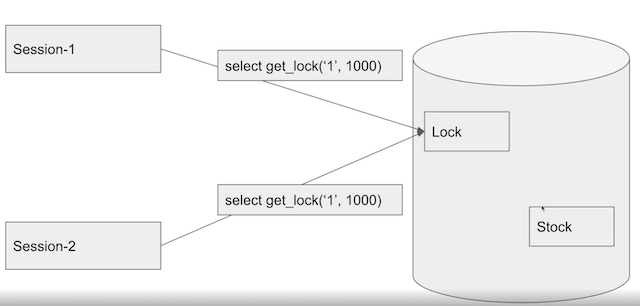

## 멀티 스레드 동시성 문제


### Race Condition issue
둘 이상의 스레드가 고융 데이터에 엑세스할 수 있고 동시에 변경하려고 할 때 발생하는 문제

- 둘 이상의 스레드 : 요청
- 공유 데이터 : Stock id가 1의 데이터 
- 동시에 변경 : 멀티 스레드 환경에서 stock id 1 에 대한 재고 감소 업데이트
- 발생하는 문제 : 기대하는 값으로 정상적으로 바뀌지 않음

### 문제 해결

#### 1. 하나의 스레드에서만 데이터에 엑세스 가능하게 한다.

java의 synchronized를 이용하여 해당 메서드의 스레드를 제한한다. 

```java
@Transactional
public synchronized void decrease(Long id, Long quantity) {
        Stock stock = stockRepository.findById(id).orElseThrow();

        stock.decrease(quantity);

        stockRepository.save(stock);
}
```

하지만 @Transactional 으로 인해 정상 동작하지 않음

- 해당 어노테이션은 Spring의 AOP를 이용하므로 새로운 프록시를 생성하기 때문에 동기화 된 메소드와 별개로 커밋 전에 메소드가 호출이 될수 있기 때문에 Race Condition을 보장할 수 없음

또한 가장 큰 문제는 여러 서버를 사용하게 될 때 인스턴스 단위로는 thread-safe 보장되기 때문에

Race Condition이 발생하게 됨
- 예시

| Time  | sever1      | stock | server2     |
|-------|-------------|-------|-------------|
| 10:00 | data access | 5     | -           |
| -     | -           | 5     | data access |
| 10:01 | update      | 4     | -           |
| -     | -           | 4     | update      |

#### 2. DB에 Lock을 걸어 데이터 엑세스를 순차적으로 하나씩 가능하게 한다.

1. Pessimistic Lock
   - 다른 트랜잭이 특정 row의 lock을 얻는 것을 방지합니다.
     - A 트랜잭션이 끝날때까지 기다렸다가 B 트랜잭션이 lock을 획득
   - 특정 row 를 update 하거나 delete 할 수 없습니다
   - 일반 select 는 별다른 lock이 없기 때문에 조회는 가능합니다.
   - 단점으로 성능 저하가 있음
2. Optimistic Lock
   - version 컬럼을 활용하여 실제 lock을 이용하지 않고 데이터 정합성을 맞추는 방법
   - version의 차이 발생 시 업데이트가 실패하게 되고 그걸 처리하는 로직 필요
   - race condition 이 빈번히 발생할 것으로 예상되면 pessimistic 이 성능상 유리 할 수 있음
3. Named Lock
   - 별도의 공간에 lock을 거는 형태
   - 분산락을 구현할때 사용, 실무에서 사용시에는 데이터소스가 분리되어있어야함 (커넥션 풀이 부족해짐)
   - 트랜잭션 종료 시 락 헤제, 세션관리 등을 주의하여야해서 복잡해질 수 있음
   


 